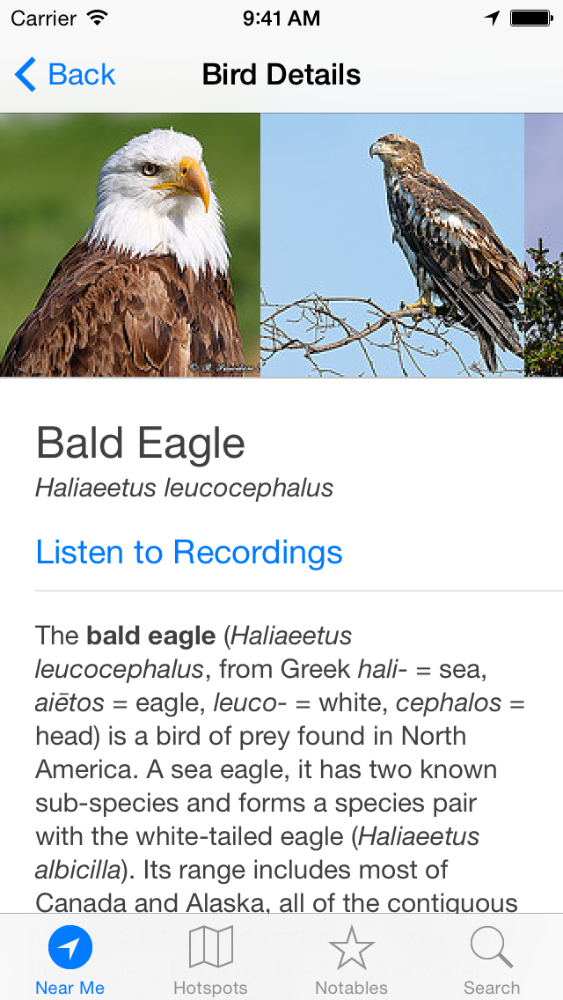
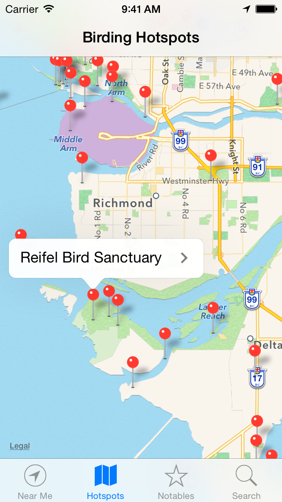
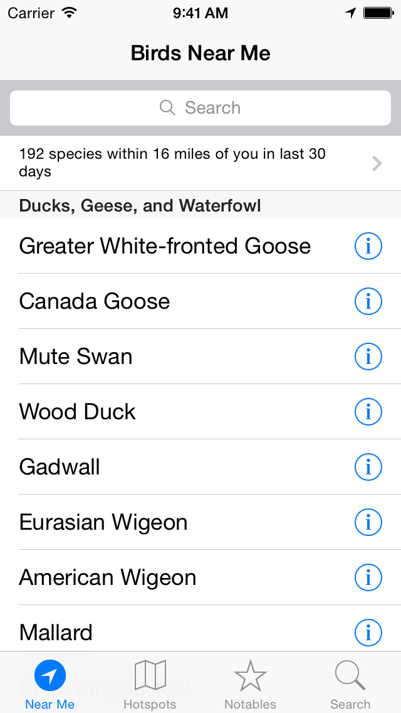

Worldwide birding field guide for iOS. Free. No ads. Privacy respected.

The bird guide for everybody everywhere in the world. Find what birds are near you anywhere in the world or find pictures, songs, locations and information about any bird in the world.

Powered by eBird to provide an accurate list of birds that have been recently spotted in your exact area.

### Features

- Search for pictures, songs, sightings and information on more than 10,000 birds from across the entire world
- Birding hotspots around the globe
- Specific filter for notable sightings near you
- View a custom list of recent bird sightings near your location
- Supports iOS 8+
- Designed and developed by a birder, for birders

### Acknowledgements

- [eBird](https://ebird.org) and all the birders for contributing their sightings
- [Flickr](https://www.flickr.com/search/?q=birding) and photographers for sharing their photos
- [Xeno-Canto](https://www.xeno-canto.org) and recordists for sharing their audio recordings
- [Wikipedia](https://www.wikipedia.org) authors, editors and staff for the species introductions
- [Open source developers](https://swiftpackageindex.com) for sharing their work
- [Merve Ayomak](https://merveayomak.com) for the application icon
- [Lucas Larroche](https://picocss.com) for the website styling

